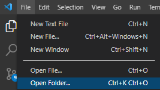

# Módulo 6: Django
---

## Laboratorios LGC

***Liliana Garmendia***

Este proyecto consiste en la creación de un sitio web con Django para un laboratorio.

El objetivo es presentar el laboratorio, su historia, productos y servicios. Y permitir que los clientes puedan comprar productos o los pacientes puedan reservar hora para los exámenes disponibles. Y los administrativos del laboratorio puedan revisar la información de los clientes, agregar nuevos productos, servicios, etc. Para esto se consta con restricción de permisos para estas acciones.

A futuro se va a implementar la página de productos, servicios, el sistema para agendar horas, y revisar resultados.

## Instalación

-Clonar el repositorio usando gitbash o el terminal que tenga en su computador local con el siguiente comando:

\\\ git clone https://github.com/LiliGC/M6_DJANGO_individual.git \\\

-Abrir la carpeta con el repositorio clonado en un editor de texto como Visual Studio Code con la opción indicada en la imagen.

-Abrir un nuevo terminal en Visual Studio Code y crear el entorno virtual con el siguiente comando:

\\\ pip install venv venv \\\

-Luego activar el entorno virtual:

\\\ cd venv/cd Scripts/activate \\\

-Volver a la carpeta principal con cd ..

-Ahora instalar requirements con el siguiente comando:

\ pip install -r requirements.txt

-Hacer las migraciones con el comando:

\ python manage.py migrate

-Crear tu superusuario para acceder al admin:

\ python manage.py createsuperuser

-Y finalmente levantar el servidor con:

\ python manage.py runserver

**Observaciones:** Si quisieras cargar los datos que utilicé de prueba tendrías que poner: \python manage.py loaddata data.json  y luego correr el comando \ python manage.py migrate.

## Características de la aplicación

* La aplicación labtienda  consta de una landing page del laboratorio.

* Templates para iniciar sesión o crear una cuenta de usuarios, registro de clientes mediante un formulario de registro, lista de clientes en forma de tabla. 

* Si inicias sesión, te da un mensaje de bienvenida y te permite el acceso a  ver la lista de clientes, agregar nuevos clientes mediante formulario de registro.

* Además tiene restringido el acceso a páginas usando los decoradores @login_required y @staff_member_required, este último usado para restringir el acceso a ver la lista de clientes y agregar nuevos clientes para el staff de la aplicación.

## Librerias usadas

Revisar el archivo requirements.txt. Algunas observaciones:

* Se usó la versión más reciente de Django para crear la aplicación.

* Se usó HTML, Bootstrap 5, CSS, JavaScript para crear los templates.

* Para el formulario se usó los que trae django junto con crispy forms para el estilo.

* Para las tablas con el listado de clientes se uso DataTable de jquery.

* Para los mensajes de alerta se usó la librería de sweetalert2.

* Se modificó la página del admin importando la librería admin_interface.
